<picture>
  <source media="(prefers-color-scheme: dark)"  srcset="./assets/dark.svg">
  <source media="(prefers-color-scheme: light)" srcset="./assets/light.svg">
  
</picture>

## 📊 GitHub Stats

<picture>
  <source media="(prefers-color-scheme: dark)"  srcset="https://raw.githubusercontent.com/gokul-webdev/gokul-webdev/output/snake-dark.svg">
  <source media="(prefers-color-scheme: light)" srcset="https://raw.githubusercontent.com/gokul-webdev/gokul-webdev/output/snake-light.svg">
  
</picture>
